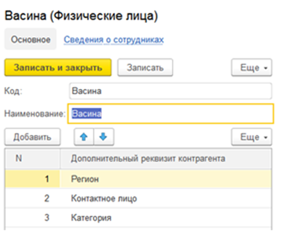
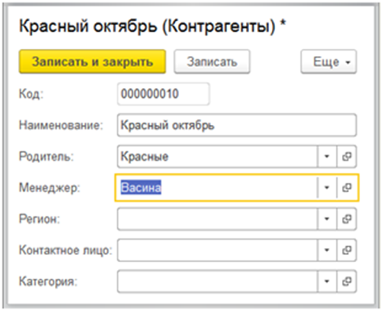

## Билет 14 (занятиe 126)

Необходимо для каждого менеджера реализовать список дополнительных сведений, которые он будет вводить для своего контрагента.

Сам менеджер будет указываться в форме контрагента.

Список  дополнительных сведений указывается в форме менеджера, должен быть реализован с помощью плана видов характеристик.

В форме же контрагента в зависимости от выбранного менеджера должны появиться дополнительные поля для ввода информации.
То есть если, например, у менеджера список дополнительных реквизитов такой:


 
 
То при выборе этого менеджера вид формы контрагента должен быть следующий:




### Настройка свойств контрагентов

Пример можно взять [здесь](/0%20-%20общее/03%20как%20добавить%20характеристики%20объектов.md). В качестве объекта для доп. свойств будет выступать `Контрагент`.


### Настройка физлиц (менеджеров)
Создаем ТЧ `СписокСвойств`:
- реквизиты:
	- Свойство: ПВХ `СвойстваОбъектов`


### Настройка контрагентов

1. Добавляем реквизит `Мененджер` - физлица

2. Настройка формы элемента
	- Добавляем реквизит формы `ТаблицаСоответствия`:
		- тип: Таблица значений
		- колонки:
			- ИмяРеквизита: строка
			- Свойство: ПВХ
	- Создаем группу `ГруппаСвойстваКонтрагентов`
		- группировка: вертикальная

3. Добавляем свойства контрагента на форму

	Необходимо программно создать реквизиты, которые будут выведены на форму. Добавление реквизитов состоит из 2 частей:
	- добавить реквизит (по наименованию) в список реквизитов
	- вывести реквизиты на форму

	Для вывода реквизитов делаем следующий алгоритм:
	- Из справочника `ФизическиеЛица` достаем информацию о свойствах, которые устанавливает менеджер:
		- само свойство (ссылка)
		- наименование
		- тип значения
	- Добавляем элементы выборки в список:
		- с помощью `РеквизитФормы()` создаем реквизит
		- заносим в `ТаблицаСоответствия` информацию о парах `Имя реквизита - Свойство`, например, Реквизит1 - Область
	- Добавляем реквизиты из списка
	- Выводим добавленные реквизиты на форму:
		- создаем новых элемент с помощью `Элементы.Добавить()`
		- для вывода элемента добавляем информацию о свойствах `Вид` (поле ввода) и `ПутьКДанным` (имя реквизита)

	```1c
	Процедура ВывестиСвойстваКонтрагента() 
		// отбор по реквизитам текущего менеджера
		Запрос = Новый Запрос;
		Запрос.Текст = 
			"ВЫБРАТЬ
			|	ФизическиеЛицаСписокСвойств.Свойство.Ссылка КАК Свойство,
			|	ФизическиеЛицаСписокСвойств.Свойство.Наименование КАК Наименование,
			|	ФизическиеЛицаСписокСвойств.Свойство.ТипЗначения КАК ТипЗначения
			|ИЗ
			|	Справочник.ФизическиеЛица.СписокСвойств КАК ФизическиеЛицаСписокСвойств
			|ГДЕ
			|	ФизическиеЛицаСписокСвойств.Ссылка = &Менеджер";
		
		Запрос.УстановитьПараметр("Менеджер", Объект.Менеджер);
		
		РезультатЗапроса = Запрос.Выполнить();
		Выборка = РезультатЗапроса.Выбрать(); 
		
		ДобавляемыеРеквизиты = Новый Массив;
		Счетчик = 1;
		
		// добавляем реквизиты в список
		Пока Выборка.Следующий() Цикл
			ИмяРеквизита = "Реквизит" + Счетчик;
			Счетчик = Счетчик + 1;
			
			Реквизит = Новый РеквизитФормы(ИмяРеквизита, Выборка.ТипЗначения, , Выборка.Наименование);	
			ДобавляемыеРеквизиты.Добавить(Реквизит);
				
			// добавляем соответствие: реквизит - свойство
			// например: 
			// - Реквизит1 - Область
			// - Реквизит2 - Контактное лицо
			НоваяСтрока = ТаблицаСоответствия.Добавить();
			НоваяСтрока.ИмяРеквизита = ИмяРеквизита;
			НоваяСтрока.Свойство = Выборка.Свойство;
		КонецЦикла;
		
		// добавляем реквизиты из списка
		ИзменитьРеквизиты(ДобавляемыеРеквизиты);
		
		// выводим реквизиты на форму
		Для Каждого Реквизит Из ДобавляемыеРеквизиты Цикл
			ЭлементФормы = Элементы.Добавить(Реквизит.Имя, Тип("ПолеФормы"), Элементы.ГруппаСвойстваКонтрагентов);
			ЭлементФормы.Вид = ВидПоляФормы.ПолеВвода;
			ЭлементФормы.ПутьКДанным = Реквизит.Имя;
		КонецЦикла;
	КонецПроцедуры 
	```

4. Заполняем свойства контрагента

	Для заполнения свойств необходимо:
	- Получить информацию о контрагенте (свойство - значение) из РС `СвойстваКонтрагентов`
	- С помощью `ТаблицаСоответствия` получаем пару `Имя реквизита - Свойство` (делаем отбор по свойству)
	- Заполняем реквизит значением свойства

	```1c
	Процедура ЗаполнитьСвойстваКонтрагента()
		// отбор свойств по контрагенту
		Запрос = Новый Запрос;
		Запрос.Текст = 
			"ВЫБРАТЬ
			|	СвойстваКонтрагентов.Свойство КАК Свойство,
			|	СвойстваКонтрагентов.Значение КАК Значение
			|ИЗ
			|	РегистрСведений.СвойстваКонтрагентов КАК СвойстваКонтрагентов
			|ГДЕ
			|	СвойстваКонтрагентов.Контрагент = &Ссылка";
		
		Запрос.УстановитьПараметр("Ссылка", Объект.Ссылка);
		
		РезультатЗапроса = Запрос.Выполнить();
		Выборка = РезультатЗапроса.Выбрать();
		
		Пока Выборка.Следующий() Цикл
			// Ищем, в какой реквизит нужно записать данные
			// Например, в СоответствиеРеквизитовТипов будут значения
			// Реквизит1 - Область
			// Реквизит2 - Контактное лицо
			// 
			// Для свойства Контактное лицо необходимо заполнить Реквизит2
			Отбор = Новый Структура;
			Отбор.Вставить("Свойство", Выборка.Свойство);
			Строки = ТаблицаСоответствия.НайтиСтроки(Отбор);
			Если Строки.Количество() = 0 Тогда
				Продолжить;
			КонецЕсли;
			
			// Заполняем реквизит необходимым значением
			// Например, Контактное лицо - Иванов ->
			// подставляем в Реквизит2
			ИмяРеквизита = Строки[0].ИмяРеквизита;
			ЭтотОбъект[ИмяРеквизита] = Выборка.Значение;
		КонецЦикла;
		
	КонецПроцедуры
	```

5. Изменение реквизитов при смене менеджера

	Чтобы не было ошибок при смене менеджера, необходимо очищать следующие данные:
	- элементы с формы
	- список добавленных реквизитов
	- таблицу соответствия (при смене менеджера теряет актуальность)

	```1c
	// удаляем данные, которые могли остаться от прошлого менеджера
	Процедура ОчиститьСвойстваКонтрагента() 
		УдаляемыеРеквизиты = Новый Массив; 
		
		Для Каждого Строка Из ТаблицаСоответствия Цикл
			// добавляем реквизит в список на удаление
			ИмяРеквизита = Строка.ИмяРеквизита;
			УдаляемыеРеквизиты.Добавить(ИмяРеквизита);
			
			// удаляем элемент с формы
			Элемент = Элементы.Найти(ИмяРеквизита);
			Элементы.Удалить(Элемент);
		КонецЦикла;
		
		// удаляем реквизиты
		ИзменитьРеквизиты(, УдаляемыеРеквизиты);
		
		// очищаем соответствие имени реквизитов и свойств,
		// которое могло остаться от прошлого менеджера
		ТаблицаСоответствия.Очистить();
	КонецПроцедуры
	```


6. Обновление информации о контрагенте при записи элемента

	При записи необходимо сделать следующее:
	- очищаем сведения о свойствах, т.к. для нового менеджера свойства становятся неактуальными
	- записываем новую информацию

	```1c
	// ПРИ ЗАПИСИ НА СЕРВЕРЕ

	// очищаем все записи о контрагенте
	НаборЗаписей = РегистрыСведений.СвойстваКонтрагентов.СоздатьНаборЗаписей();
	НаборЗаписей.Отбор.Контрагент.Установить(Объект.Ссылка);
	НаборЗаписей.Записать();
	
	// записываем новую информацию
	Для Каждого Строка Из ТаблицаСоответствия Цикл
		ИмяРеквизита = Строка.ИмяРеквизита;
		Свойство = Строка.Свойство;
		
		Если НЕ ЗначениеЗаполнено(ЭтотОбъект[ИмяРеквизита]) Тогда
			Продолжить;
		КонецЕсли;
		
		Запись = РегистрыСведений.СвойстваКонтрагентов.СоздатьМенеджерЗаписи();
		Запись.Контрагент = Объект.Ссылка; 
		Запись.Свойство = Свойство;
		Запись.Значение = ЭтотОбъект[ИмяРеквизита];
		Запись.Записать();
	КонецЦикла;
	```


7. Для РС `СвойстваКонтрагентов` убираем видимость команды: вкладка `Команды` - снять флажок `Использовать стандартные команды`

> После этого на форме элемента `Контрагенты` исчезнет ссылка на регистр сведений

 
