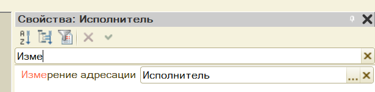
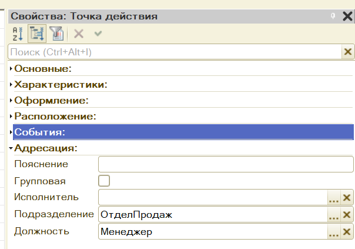

# Общие моменты по УФ и БП

## Оглавление
- [Создание пользователей](#user-creation)
- [Связывание пользователей и физических лиц](#user-and-person)
- [Работа с функциональными опциями](#fo)
- [Работа с параметризуемыми функциональными опциями](#fo-params)
- [Бизнес-процессы](#business-processes)


## <a name="user-creation"></a>Создание пользователей

1. Создаем роль `Полные права`.

2. Выставляем все доступные права на справочники/документы и пр. 

3. Выставляем флажок `Устанавливать права для новых объектов`

4. Создаём хотя бы одного пользователя с полными правами


## <a name="user-and-person"></a>Связывание пользователей и физических лиц

1. Создаём параметр сеанса `ТекущийПользователь`, тип - `ФизическиеЛица`

2. Становимся на корень конфигурации - ПКМ - Открыть `Модуль сеанса`

3. В доступных функциях модуля сеанса (как в документе ПриЗаписи, ПриПроведении и пр.) выбираем единственную доступную функцию `УстановитьПараметрыСеанса`

4. Записываем следующий код:
	```1c
	Процедура УстановкаПараметровСеанса(ТребуемыеПараметры)  
		// получаем имя текущего пользователя
		Имя = ПользователиИнформационнойБазы.ТекущийПользователь().Имя;
		
		// получаем физлицо по имени-коду
		ФизЛицо = Справочники.ФизическиеЛица.НайтиПоКоду(Имя);
		// если такого пользователя нет, то создаем и присваиваем 
		// переменной ФизЛицо
		Если ФизЛицо.Пустая() Тогда 
			ФизЛицоОбъект = Справочники.ФизическиеЛица.СоздатьЭлемент();
			ФизЛицоОбъект.Код = Имя;
			ФизЛицоОбъект.Наименование = Имя;
			ФизЛицоОбъект.Записать();
			
			ФизЛицо = ФизЛицоОбъект.Ссылка;
		КонецЕсли; 
		
		ПараметрыСеанса.ТекущийПользователь = ФизЛицо;
	КонецПроцедуры
	```

## <a name="fo"></a>Работа с функциональными опциями

1. Заводим необходимую функциональную опцию, например, `ИспользоватьСклады`.

2. Для хранения значения создаём константу. Для ФО указываем в параметре `Хранение` созданную константу.

3. На вкладке `Состав` указываем, какой функционал будет включать/выключать константу. На примере складов нужно:
	- отметить `справочник` Склады
	- отметить `реквизиты/колонки ТЧ/измерения и пр.`, которые имеют тип Склады

> Данный метод установит функциональную опцию для всех пользователей (т.к. он воздейтвует на всю информационную базу)


## <a name="fo-params"></a>Работа с параметризуемыми функциональными опциями

Если требует ФО, которая действует не на всю базу, а по какому-то признаку пользователей (например, в зависимости от должности), то нужно создавать параметризуемые ФО.

### Настройка ФО

Здесь будет рассмаривать доступ к подсистема на основе должности.

1. Заводим функциональные опции, например, `ДоступОУ`, `ДоступБУ`, `ДоступСПР`.

2. Для хранения значения создаём регистр сведений `ДоступКПодсистемам`:
	- непериодический
	- измерения: Должность
	- ресурсы: `ОУ`, `БУ`, `СПР` (булево)

3. Для каждой ФО указываем в `Хранение` необходимый ресурс

4. Выбираем необходиые элементы на вкладке `Состав`.


### Настройка параметров ФО

Чтобы система определяла, какая должность у пользователя, и какой у него доступ, необходимо:

1. Создать параметр функциональной опции - `Должность`, связать с измерением регистра сведений `ДоступКПодсистемам`.

2. Для получения должности пользователя создаем общий модуль `ОбщегоНазначенияВызовСервера`
	- флажки `сервер` и `вызов сервера`

3. Записываем код, который получает должность пользователя
	```1c
	Функция ПолучитьДолжностьПользователя() Экспорт
		
		Запрос = Новый Запрос;
		Запрос.Текст = 
			"ВЫБРАТЬ
			|	ФизическиеЛица.Должность КАК Должность
			|ИЗ
			|	Справочник.ФизическиеЛица КАК ФизическиеЛица
			|ГДЕ
			|	ФизическиеЛица.Ссылка = &Ссылка";
		
		Запрос.УстановитьПараметр("Ссылка", ПараметрыСеанса.ТекущийПользователь);
		РезультатЗапроса = Запрос.Выполнить();
		Выборка = РезультатЗапроса.Выбрать();
		
		Если Выборка.Следующий() Тогда
			Возврат Выборка.Должность;
		КонецЕсли;
		
		Возврат Неопределено;

	КонецФункции
	```

3.  Становимся на корень конфигурации - ПКМ - Открыть `Модуль приложения`

4. В доступных функциях модуля приложения выбираем `ПередНачаломРаботыСистемы` и выбираем записываем код по установке параметров ФО:
	```1c
	Процедура ПередНачаломРаботыСистемы(Отказ)
		Должность = ОбщегоНазначенияВызовСервера.ПолучитьДолжностьПользователя();
		ПараметрыФО = Новый Структура("Должность", Должность);
		УстановитьПараметрыФункциональныхОпцийИнтерфейса(ПараметрыФО);
	КонецПроцедуры
	```

## <a name="business-processes"></a>Бизнес-процессы

Для работы необходимо наличие пользователей и параметра сеанса текущий пользователь.

### Настройка регистра адресации

Настраиваем регистр сведений `РегистрАдресации`:
- измерения:
	- исполнитель: физлицо
	- подразделение: подразделение
	- должность: должность

### Настройка задачи

Создаем задачу `ЗадачиИсполнителям`.

Создаем реквизиты задачи - такие же, как измерения в РС `РегистрАдресации`

На вкладке `Адресация` настраиваем:
- Для каждого реквизита устанавливаем связь с измерением РС
	
- Адресация: РС `РегистрАдресации`
- Основной реквизит адресации: `Исполнитель`
- Текущий исполнитель: параметр сеанса `ТекущийПользователь`


Создаем форму списка (не основная):
- Изменяем основную таблицу реквизита формы `Список` c Задача.ЗадачиИсполнителям на `Задача.ЗадачиИсполнителям.ЗадачиПоИсполнителю`
- Устанавливаем отбор реквизита `Список`: Настройка списка -> Добавляем отбор `Выполнена Равно Ложь`


### Создание бизнес процесса

Создаем бизнес-процесс. 

Добавляем задачу `ЗадачиИсполнителям`.

Рисуем маршрут процесса:
- Если сказано `Все кладовщики`, то:
	- выбираем в `Должности` - Кладовщик
	- ставим галочку `Групповая`
- Если сказано `Любой кладовщик`, то:
	- выбираем в `Должности` - Кладовщик
- Если указан конкретный человек, то заносим его в поле `Исполнитель`

Как выглядит установка:




Создаем форму бизнес-процесса:
- Добавляем реквизит `КартаМаршрута`: ГрафическаяСхема
- Добавляем код по обновлению схемы:
	```1c
	&НаСервере
	Процедура ОбновитьКартуМаршрута() 
		БПОбъект = РеквизитФормыВЗначение("Объект");
		КартаМаршрута = БПОбъект.ПолучитьКартуМаршрута();
	КонецПроцедуры
	```
- Вызываем метод для обновления в методах `ПриСозданииНаСервере` и `ПослеЗаписиНаСервере`

### Выводим форму невыполненных задач

Становимся на корень конфигурации -> ПКМ -> `Открыть рабочую область начальной страницы`.

Выбираем форму списка задачи.

### Данные об исполнителях

В режиме предприяти вносим данные в РС `Регистр адресации`:
- Если указан конкретный пользователь (например, Иванов), то данные по нему вносить не нужно
- Если указано `все кладовщики/любой кладовщик`, то вносим запись:
	- Исполнитель
	- Должность: кладовщик
- Если указано `менеджер отдела продаж`, то вносим запись:
	- Исполнитель
	- Должность: менеджер
	- Подразделение: отдел продаж

### Запуск бизнес-процесса

В предприятии создаем процесс и всё.
