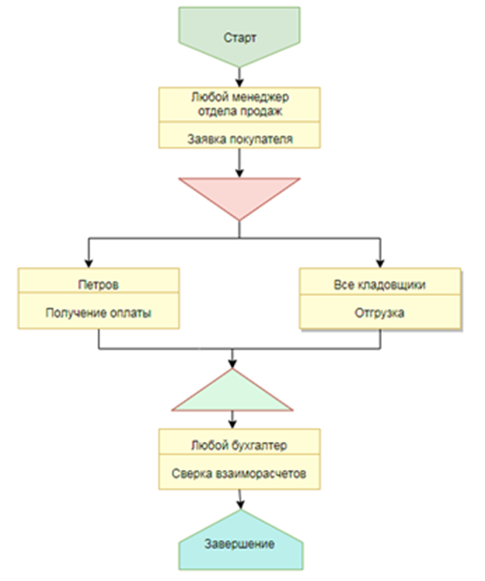

## Билет 1 (занятиe 127)

|Сотрудник		|Подразделение		|Должность		|
|---------------|-------------------|---------------|
|Васина			|Бухгалтерия		|Кассир			|
|Мишина	|Бухгалтерия	|Кассир
|Мишина	|Бухгалтерия	|Бухгалтер
|Кротов	|Бухгалтерия	|Бухгалтер
|Иванов	|Бухгалтерия	|Гл. бухгалтер
|Хабибулин	|Отдел продаж	|Начальник отдела
|Крамер	|Отдел продаж	|Зам. начальника отдела
|Галкин	|Отдел продаж	|Менеджер
|Палкин	|Отдел продаж	|Менеджер
|Малкин	|Отдел продаж	|Менеджер
|Залкинд	|Отдел продаж	|Кладовщик
|Лоханкина	|Отдел продаж	|Кладовщик
|Рахимов	|Отдел закупок	|Менеджер
|Мансуров	|Отдел закупок	|Менеджер
|Жупиков	|Отдел закупок	|Кладовщик

### Пользователи и параметры сеанса

Стандартное заполнение, прочитать можно [здесь](/УФ%20и%20БП/уф%20общее.md)

### Предварительная подготовка

Создаем справочник `Должности`.

Добавляем предопределенные.

### Физические лица

Добавляем реквизит `Должность`

### Создание бизнес-процесса

Стандартное, прочитать можно [здесь](/УФ%20и%20БП/уф%20общее.md)

В регистр сведений `Регистр адресации` необходимо внести записи:

|Сотрудник		|Подразделение		|Должность		|
|---------------|-------------------|---------------|
|Галкин	|Отдел продаж	|Менеджер
|Палкин	|Отдел продаж	|Менеджер
|Малкин	|Отдел продаж	|Менеджер
|Залкинд	| |Кладовщик
|Лоханкина	| |Кладовщик
|Жупиков	| |Кладовщик
|Мишина	| |Бухгалтер
|Кротов	| |Бухгалтер
