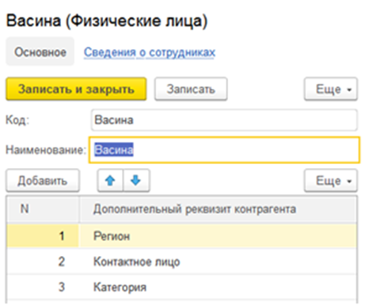
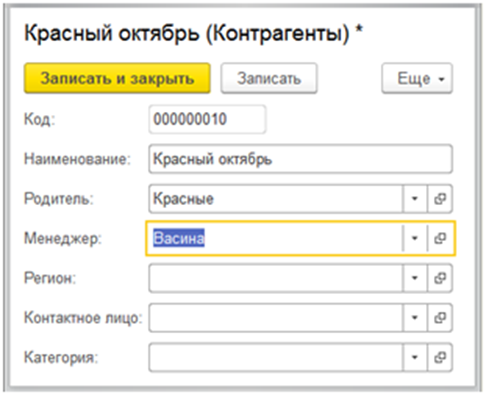

## Билет 14 (занятиe 126)

Необходимо для каждого менеджера реализовать список дополнительных сведений, которые он будет вводить для своего контрагента.

Сам менеджер будет указываться в форме контрагента.

Список  дополнительных сведений указывается в форме менеджера, должен быть реализован с помощью плана видов характеристик.

В форме же контрагента в зависимости от выбранного менеджера должны появиться дополнительные поля для ввода информации.
То есть если, например, у менеджера список дополнительных реквизитов такой:

 
 
То при выборе этого менеджера вид формы контрагента должен быть следующий:

 
